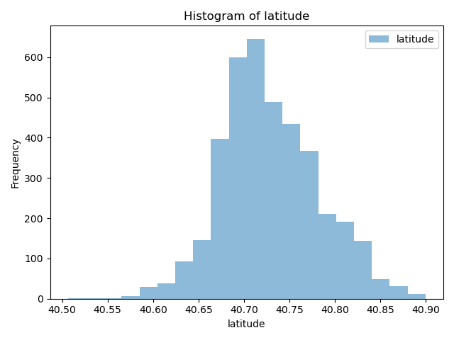
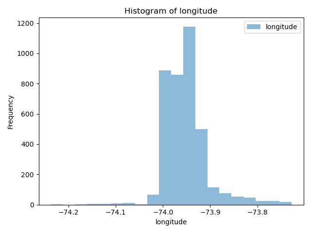
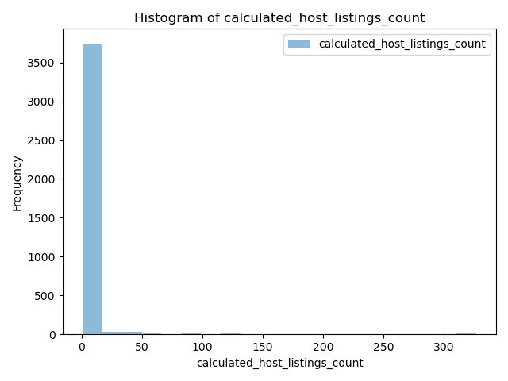
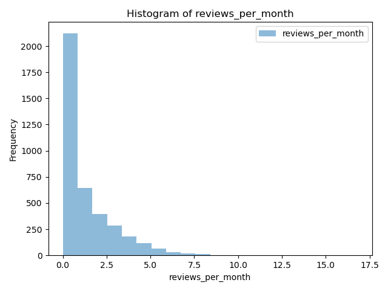

# results/eda/hist_latitude.png 
#results/eda/hist_longitude.png 
#results/eda/hist_availibility_365 
#results/eda/hist_calculated_host_listings_count.png 
#results/eda/minimum_nights.png 
#results/eda/hist_price.png 
#results/eda/hist_reviews_per_month.png 
#results/eda/scatter_long_lat.png 
#results/eda/scatter_price_min_nights.png 
#results/eda/scatter_hostlistings_availibility.png 
#results/eda/correlation.png 

